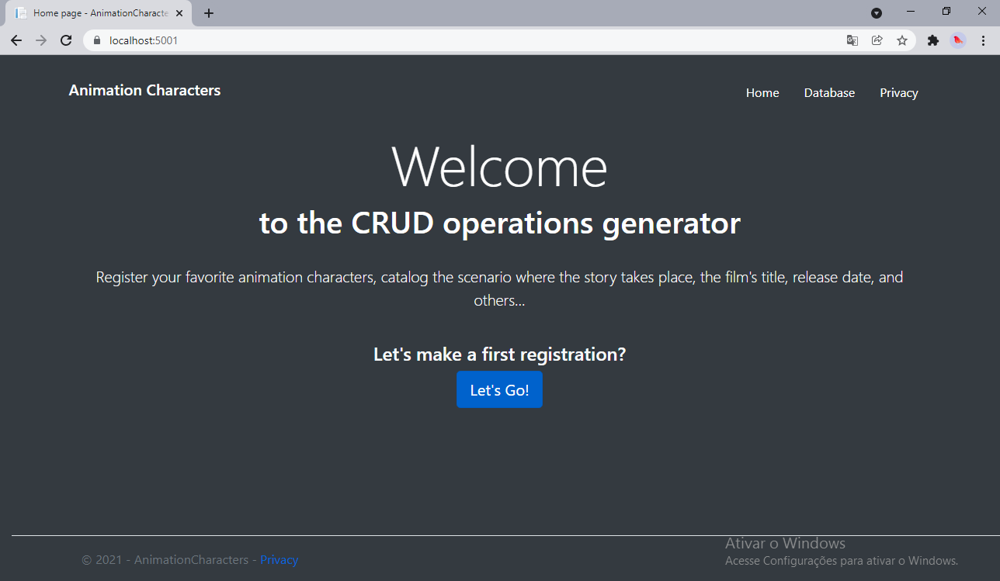

# Teste Técnico

Este projeto tem por objetivo desenvolver uma aplicação web multiplataforma utilizando C# .NET core, com o editor Visual Studio Code. 

Tema do projeto: "Personagens de um filme de animação".

# Introdução

Este projeto foi desenvolvido utilizando o framework .NET, em sua versão 5.0, mais especificamente a tecnologia ASP.NET, que é voltada para o desenvolvimento Web. Na aplicação Web será utilizado o C#, umas da linguagens de programação suportada pelo framework.

# Passos na Criação e Desenvolvimento da Aplicação

### Criação da Aplicação Web

Inicialmente foi feito os seguintes comandos para criação do projeto e uma confirmação de confiança no certificado de desenvolvimento HTTPS:

```vbnet
// Criação do projeto
dotnet new webapp -o AnimationCharacters -f net5.0

// Confirmação de confiança
dotnet dev-certs https --trust
```

Em seguida foi iniciado o projeto utilizando o comando `dotnet wacth run`, que irá fazer o *build* e *startar* a aplicação, mantendo-a ativa e atualizando sempre que houver qualquer mudança. O comando iniciará um navegador com o seguinte caminho `http://localhost:5001`

> Localhost serve somente para solicitações da Web do computador local.
> 

.png)

.png)

### Adicionar modelos de Dados

Com o criação do projeto, foi adicionado a pasta *Models*, que, por sua vez, contem a classe *Character.*

A classe `AnimationCharacter` contém:

- O campo `ID`, necessário para o banco de dados, sendo a chave primária.
- Alguns dados referente ao Personagem `Charater`, como: `Scenery`, `Age` e `Name`. Propriedades com dados do tipo `string` e `int`.
- `[DataType(DataType.Date)]`: O atributo `[DataType]` especifica o tipo dos dados ( `Date` ). Com esse atributo:
    - O usuário não é solicitado a inserir informações de hora no campo de data.
    - Somente a data é exibida, não as informações de tempo.

### Sccafold do modelo e Operação CRUD

Nesta seção, foi feito o scaffold do modelo. 

> A ferramenta de scaffolding gera páginas para operações de CRUD (Criar, Ler, Atualizar e Excluir) para o modelo.
> 

```vbnet
dotnet-aspnet-codegenerator razorpage -m Character -dc AnimationCharactersContext -udl -outDir Pages/Character --referenceScriptLibraries -sqlite
```

No comando acima foi definido as "características" do modelo, e determinado como uso para desenvolvimento de dados o Sqlite. A tabela a seguir detalha as opções do gerador de código ASP.NET Core.

| Opção | Descrição |
| --- | --- |
| -m | o nome do modelo |
| -dc | a classe DbContext a ser usada |
| -udl | Use o Layout padrão |
| -outDir | O caminho da pasta de saída relativa para criar as exibições. |
| --referenceScriptLibraries | Adiciona _ValidationScriptsPartial para editar e criar páginas |

### Criação das *Database Migrations* e uso do recurso EF

Criado o esquema de banco de dados inicial e atualizado, incrementalmente, o esquema de banco de dados para mantê-lo em sincronia com o modelo de dado do aplicativo com os seguintes comandos:

```vbnet
dotnet ef migrations add InitialCreate
dotnet ef database update
```

 O banco de dados existente é preservado.

> O comando `migrations` gera código para criar o esquema de banco de dados inicial. O esquema é baseado no modelo especificado em `DbContext` . O argumento `InitialCreate` é usado para nomear as migrações. Qualquer nome pode ser usado, mas, por convenção, um nome que descreve a migração é selecionado.

O `update` comando executa o método em `Up` migrações que não foram aplicadas. Nesse caso, executa o método no arquivo `update` `Up` *Migrations/_InitialCreate.cs, <time-stamp>* que cria o banco de dados.
> 

### Testando o App Web

.png)

.png)

.png)

.png)

.png)

## Alteração do Layout

Após terminado a base estrutural do projeto, foi alterado a coloração, tipografia e distribuição da divisões do Layout. Veja a seguir o resultado final do projeto:



.png)

.png)

.png)

.png)

.png)

# Dicionário do Programador

### Design Patterns

Os *Design Patterns*, também conhecido como **Padrões de Objetos**, estão relacionados com a arquitetura e engenharia de software, sendo assim, alguns padrões de objetos estão intimamente ligados ao *Paradigma de Orientação a Objetos.*

*Design Patterns* nada mais é do que: "Soluções elegantes, prontas, pensadas, testadas e aprovadas, de problema que acontecem no dia a dia de um programador".

## Introdução às Razor páginas no ASP.NET Core

> As Razor páginas podem tornar cenários com foco na página de codificação mais fácil e produtivo do que o uso de controladores e exibições.
> 

O Visual Studio inicia o IIS Express e executa o aplicativo. A barra de endereço mostra `localhost:port#` e não algo como `example.com`. Isso ocorre porque `localhost` é o nome do host padrão do computador local. Localhost serve somente solicitações da Web do computador local. Uma porta aleatória é usada para o servidor Web quando o Visual Studio cria um projeto Web.

### Razor

É a *View Engine*, ou motor de *rederização*, que o ASP.NET usa para *renderizar* páginas no lado servidor. Ele nos permite interpolar C# com HTML.

# Dúvidas

1. **Erro: `The specified deps.json [C:\Users\UsuarioAdm\source\repos\AnimationFilmsWeb\AnimationFilmsWeb\AnimationFilmsWeb.deps.json] does not exist`**
    1. O que está gerando este erro?
    2. Qual interferência ele causa na execução do aplicativo?
    
    OBS.: Este erro foi apresentado ao fazer a Migração e Atualização do banco de dados no Visual Studio, antes de recomeçar o projeto no VS Code.
    

# Detalhes

Versão do .NET: **5.0**

```vbnet
dotnet tool install --global dotnet-ef
dotnet tool install --global dotnet-aspnet-codegenerator
dotnet add package Microsoft.EntityFrameworkCore.Design -v 5.0.0
dotnet add package Microsoft.EntityFrameworkCore.SQLite -v 5.0.0
dotnet add package Microsoft.VisualStudio.Web.CodeGeneration.Design -v 5.0.0
dotnet add package Microsoft.EntityFrameworkCore.SqlServer -v 5.0.0
```